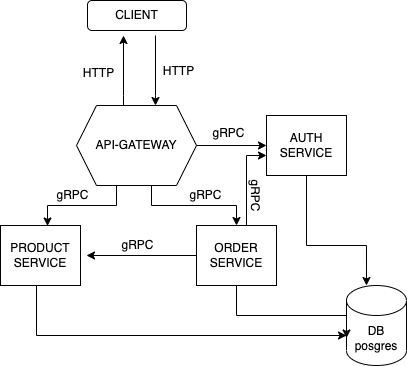

# gRPC API Gateway e-commerce service

## The following concepts are applied in app:
- gRPC gateway-api using <a href="https://github.com/grpc-ecosystem/grpc-gateway/tree/master/protoc-gen-openapiv2">openapiv2</a> 
- Authorization and authentication using a stateless approach (JWT)
- The Clean Architecture approach (DI)
- Protobuf generation using <a href="https://buf.build/">buf</a> tool.
- Postgres database using <a href="https://gorm.io">gorm</a> framework.
- Graceful Shutdown.
- Running app in docker containers (docker-compose).

### Service consists of 4 microservices:
- gateway
- auth
  - register
  - login
  - validate
- product
  - create
  - get-one
  - decrease-stock
- order (authentication)
  - create 

### to start the service:

#### to run app in docker containers
```
make run
```

#### to run tests
```
make test
```

#### commands to run app natively (don't forget about postgres)
```
go run cmd/store-gateway/main.go -c "configs/gateway.yaml"
go run cmd/store-auth/main.go -c "configs/auth.yaml"
go run cmd/store-product/main.go -c "configs/product.yaml"
go run cmd/store-order/main.go -c "configs/order.yaml"
```

#### to generate proto
```
make gen-proto
```

#### to generate mocks
```
make mocks
```

### e-commerce design:
